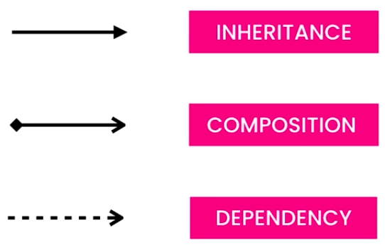
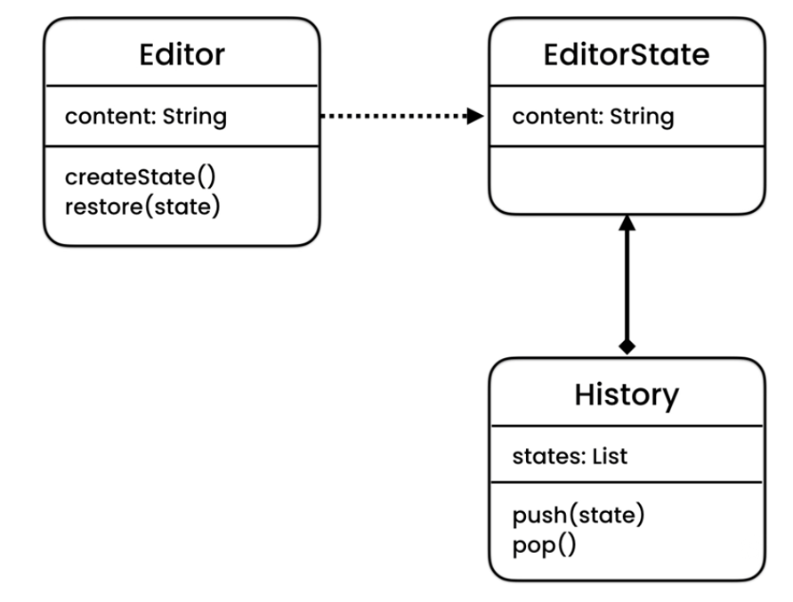

# Design Patterns

## Context

- Object-Oriented Program designed with multiple classes may be tightly coupled. i.e. change in one class may break other classes. Solution: `interfaces`.
  - Interface: A contract that defines capabilities that a class should provide. (Baically all the parameter recommendations in the IDE that gets listed on typing class name and then dot)
  - Common methods are defined in interface and implemented in class.
- 4 core principles of OOP.
  - Encapsulation: Bundling methods(setters, getters, operators etc.) into one class and hiding the state of the object. e.g. Keep the class variable as private, create set and get method (as public) to access the object.
    - Prevents object from going to invalid state (as you can add logic in methods to prevent it)
  - Abstraction: Reduce complexity by hiding unnecessary details.
    - Make the unwanted methods as private.
  - Inheritance: Mechanism for reusing code.
    - Reusable methods are defined and implemnted in base class and extended in derived class.
  - Polymorphism: Ability of object to take many forms.
    - Define the method as abstract method in base class and implement them in derived class (Override). Base class object can take on many different forms.
- UML (Unified Modelling Language)
  - Defines classes and relationship.

## What is it

- Eligent solution of recurring problems in programming.
- Collaboration and communication between classses and objects in programming.
- There are 23 classic Design Patterns (originally documented) and more.

## Categories

- Creational: about creating objects.
- Structural: about relationship between objects.
- Behavioral: about interaction \ communication between objects.

## Momento Pattern

To implement undo mechanisms.

## State Pattern

Allows an object to behave differently when its state changes.

