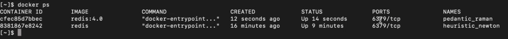
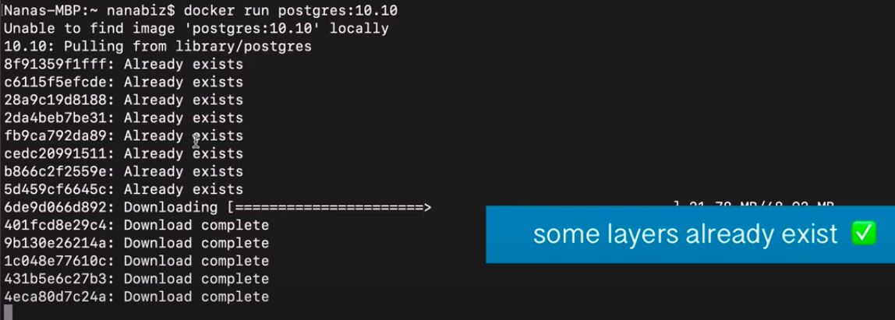

# Docker

## What is it

Creates a portable artifact (docker build) that can package an application with all necessary dependencies and configuration and store that for porting (in container repository).

## Purpose

- Makes porting easy
  - Eliminates user to execute multiple commands, or install multiple packages and configure the system to install required application for development or production.
  - Install application with one command.
- Docker hub is the public repository for containers (<https://hub.docker.com/>)

## Docker Vs Virtual Machine

- Docker virtualizes Application layer, VM virtualizes Application + OS Kernel layer.
- Docker images are smaller since it needs to virtualize only the Application layer, VMs has its own kernel which it boots from.
- Dockers are must faster to run.
- Docker with a specific guest OS cannot run on a host with a different OS (because it shares the kernel of host), not the case with VMs.

## Container ports Vs Host ports

- Every container port needs to be binded with Host port to access from host.
- This allows multiple containers to run with same port# binded to a different host port#.

## What is Docker image made of

Contains layers of images  

- Base image: it's the OS, mostly alpine (Linux) OS due to it's small size.
- Application image.

## Commands

- `docker pull <image-name>:<version>` - pull the docker image from docker repository onto the local machine.
- `docker images` - list all downloaded docker images.
- `docker run <image-name>:<version>` - pull and directly run the docker image from docker repository in the local machine as docker container.
- `docker ps` - list the running containers. Use `-a` option to list containers that are not running.

- `docker start`, `docker stop` - start \ stop containers.
